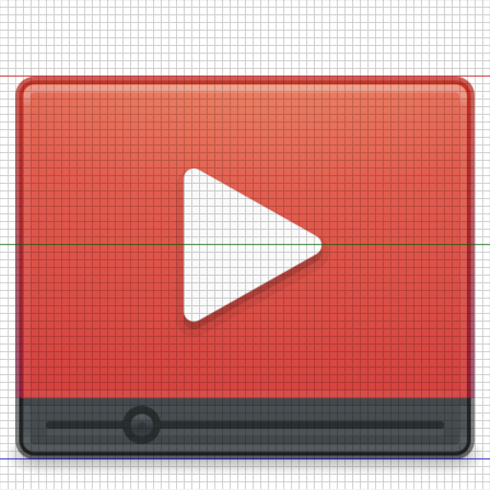
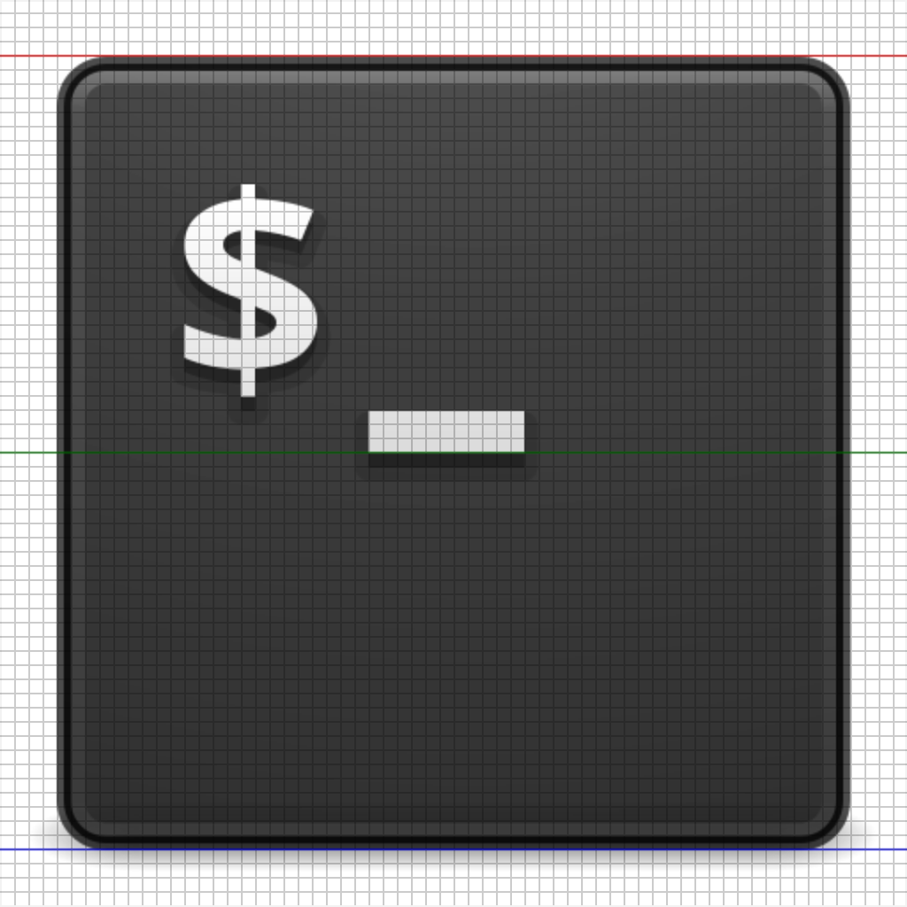
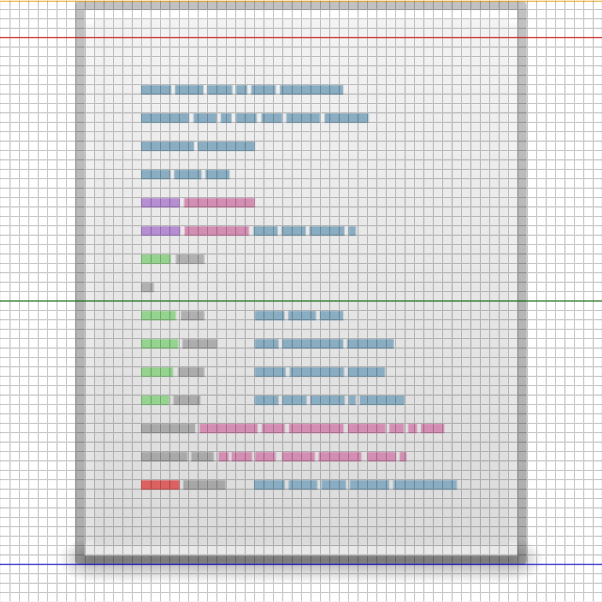
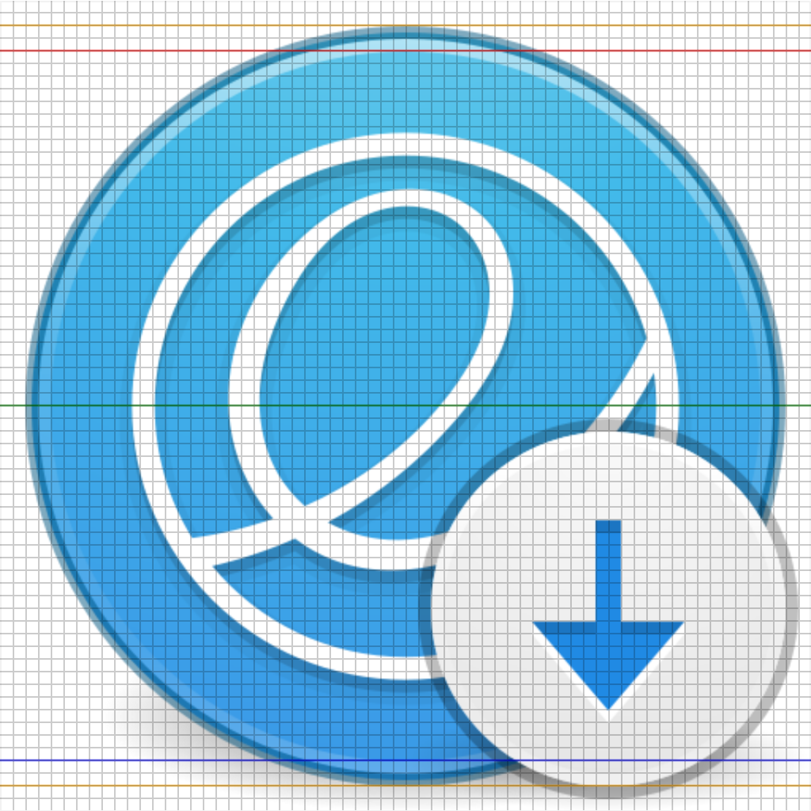
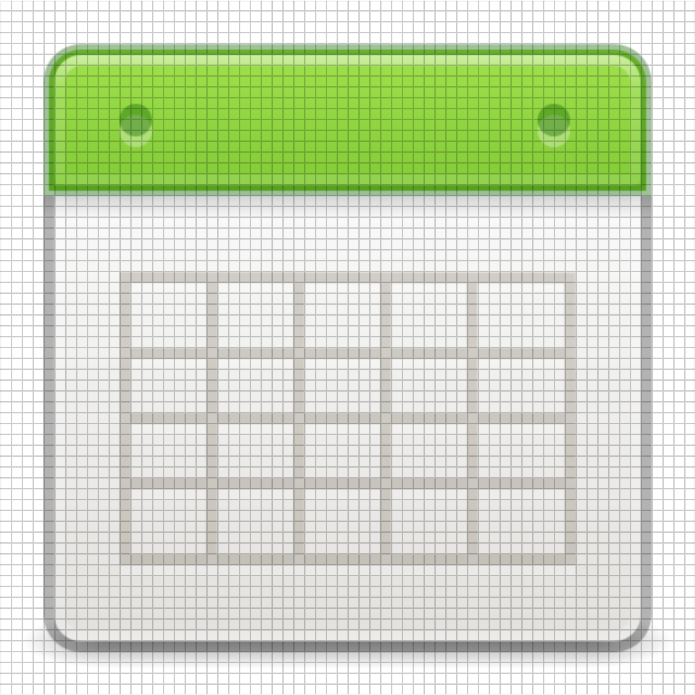
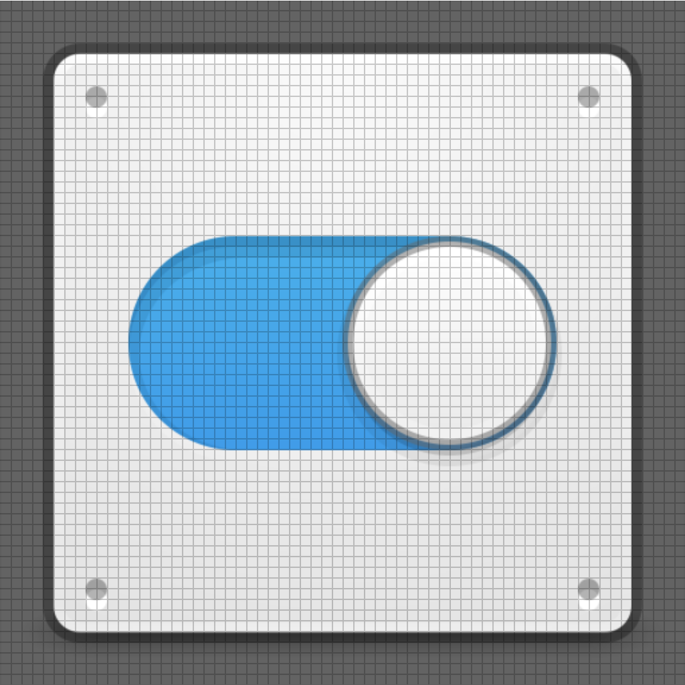
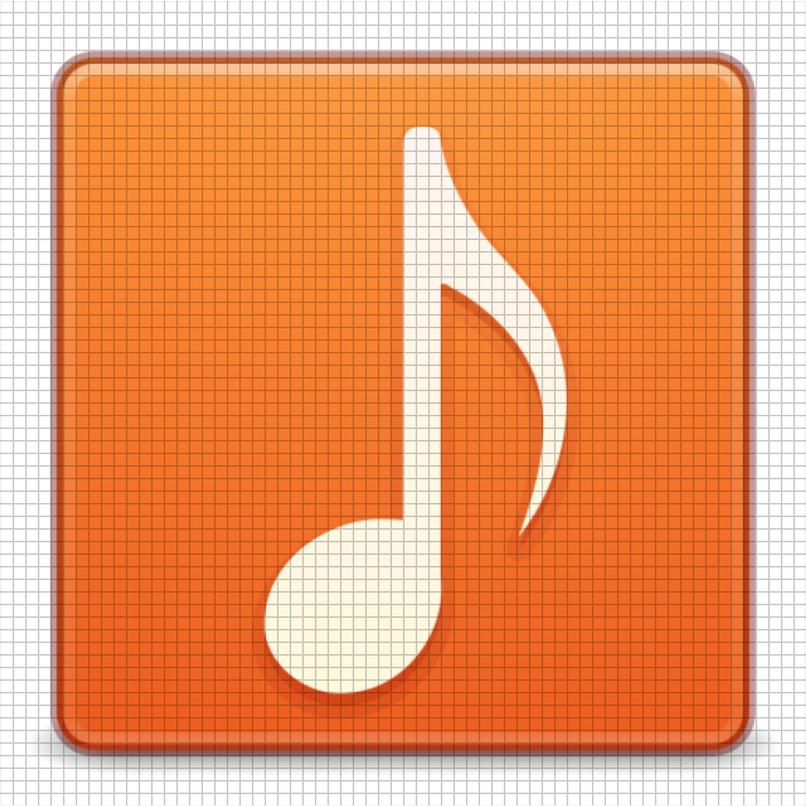

# Iconography

Iconography is a key part of elementary OS. Icons make up the majority of the UI that your user will be actively engaging with; they're what bring the system to life and cater to the powerful recognition engine of the human brain.

## Shape 

Your icon should have a distinctive shape/silhouette to improve its recognition. This shape should not be too complicated, but the icon should not always be a rounded rectangle.

     

For example, if your icon's metaphor lends itself well to a unique shape, use that shape for the overall icon shape instead of placing that shape onto a generic rectangle, square, or circle.

| Bad \(unnecessary base shape\) | Better \(unique shape\) |
| :---: | :---: |
|  |  |

### Metaphors 

If you're creating an icon for a hardware device or a file type \(such as those for MimeType or Device icons\), its shape is typically a visual representation of its real-world counterparts. For example, the icon for a camera is a stylized camera.

     

### Action Icons 

Action icons are used to represent common user actions, such as "delete", "play", or "save". These icons are mostly found in app toolbars, but can be found throughout the OS.

           

If your app makes use one of these common actions, reference its corresponding icon instead of creating your own. This ensures a consistent user experience and aids in user recognition of common functions.

If your app has a unique action, you may need to create your own. When doing this, try to follow the look and feel of existing action icons, and include it along with your app.

## Icon Sizes 

elementary OS uses **six** main icon sizes throughout the OS and it's best to include all six as part of your application.

     

16 24 32 48 64 128

128

Design each icon for the size it's meant to be viewed at. In other words, do not design one icon and resize it to fill the remaining sizes, the best result is when each icon is designed individually. For more information about this practice \(called "pixel-fitting"\) and its importance, we recommend reading [Dustin Curtis' article, Pixel-fitting](https://dcurt.is/pixel-fitting).

## Color Palette 

Color—don't be afraid to use it! Many of the elementary OS icons use vibrant colors; it's best to reserve muted tones and grays for boring system icons.

     

Colors do have their connotations, so be cognizant of this when picking them. For instance: red is usually associated with error or "danger", and orange with warnings. But you can use these color connotations to help convey your icon's meaning, such as green for "go". We use the [elementary Brand Palette](https://elementary.io/brand#color).

## Symbolic Icons 

Symbolic icons are common system icons that symbolize files, devices, or directories, and are also used to represent common actions like cut, copy, and save.

Each symbolic icon is a reduced form of its full-color counter part. This minimal design ensures readability and clarity even at small sizes.

### Colored vs. Symbolic Icons 

The use of full-color and symbolic icons is not interchangeable; both have appropriate uses.

Full-color icons are best used for:

* application icons
* files and mimetypes
* device icons
* places

Symbolic icons are best used:

* on buttons
* in lists or text fields
* for status indicators
* when the background is dynamic or semi-transparent, for example: media overlays

## Composition 

There are three aspects to note when designing an elementary OS icon:

* Its baseline \(highlighted in blue\), to ensure that all icons of one size line up along the bottom when in a row \(much like text\).
* Its mean line height \(green\), also known as the center line of the canvas.
* Its x-height \(shown in red\), or "how tall" the icon is.

 

Keeping these lines in mind while designing, means you can place elements along them to ensure that icons appear more consistent when put together. For example, notice how some elements in both the Terminal and Videos icons above relate to the mean line.

### Common Measurements 

If you're designing a square-shaped icon, like the one for Terminal seen above, then consider using these common measurements \(in pixels\) for each icon:

| Canvas Size | Base Line | x-Height | Mean Line Height |
| :--- | :--- | :--- | :--- |
| 16x16 | 1 | 14 | 8 |
| 24x24 | 2 | 20 | 12 |
| 32x32 | 2 | 26 | 16 |
| 48x48 | 3 | 40 | 24 |
| 64x64 | 4 | 56 | 32 |
| 128x128 | 9 | 104 | 64 |

### Exceptions 

However, there are exceptions. Many icons \(especially mediatype icons\) have ascending and descending elements, which are those elements that extend beyond the base line and x-height line \(shown here in orange\).

 

Rounder components will generally require some overshoot, to compensate for the optical illusion that makes them look smaller than their rectangular counterparts.

## Outlines & Contrast 

All elementary OS icons have a thin outline \(stroke\) to improve their contrast. The width of this stroke is **one** pixel for all icons, at every size. The color of the outline is a darker variant \(30% darker\) of the primary color of the icon. For instance, in the calendar icon below, the green header has a stroke of a darker green.

 

To further improve contrast, strokes are also semi-transparent. This ensures that icons appear sharp against a variety of backgrounds. Also, if the element is near-white, this stroke acts as a border and contains, rather than overlaps, its corresponding element. See the above icon for an example of this.

## Shadows & Highlights 

If you picture an icon sitting on a shelf, facing you, with a light source above it, you may see a small fuzzy shadow near the bottom. Also, since the edges of an object tends to reflect more light due to your position relative to it and to the light source, they will have a highlight. Both these effects are something elementary OS icons emulate in their design to lend them a degree of realism.

### Edge Highlight 

To apply the edge highlight effect to your icon, draw a subtle, **1 pixel**, inner stroke as a highlight. This outline is slightly brighter at the top and the bottom than it is at the edges.

### Drop Shadow 

To draw the shadow, you'll start by drawing a rectangle. Then fill it with a linear gradient that is perpendicular to the bottom margin of the icon. The gradient has three stops, the first and last of which have zero opacity. Then this entire shape is set to **60% opacity**.

Next create two smaller rectangles to "bookend" the larger. Fill each with a gradient identical to the first, but make it radial instead. Center the radial gradient in the middle of a short edge with each stop directly out to the nearest edge—see below for an example. Both these rectangles are also set to **60% opacity**.

### Pictogram Shadow 

If your icon has a pictogram, such as the play triangle in the icon below, you can give it a drop shadow to make appear extruded from the background of the icon.

To do this, first duplicate the pictogram, fill it with solid black and set it to **15% opacity**. Next, shift it 1 pixel down and place it below the pictogram. Create a copy of this shadow and give it a 1 pixel stroke \(also black\) and adjust this element to **7% opacity**.

Alternatively, you can also use a highlight and shadow to make the pictogram appear inset into the background.

| Bad \(flat pictogram\) | Better \(extruded pictogram\) | Better \(inset pictogram\) |
| :---: | :---: | :---: |
|  |  |  |

### Icon Materials 

You are free to add gloss \(extra highlights\) to your icon but this is only a good idea if you're emulating a surface that is more-reflective in real life \(such as plastic, glass, etc.\) For instance, a sheet of paper is not glossy therefore a icon emulating paper would not be either.

## Dos and Don'ts 

Below are some "do and don't" examples to consider when creating icons for your app.

* Your icon should not be overly complicated. Keep in mind that since there are smaller sizes, the elements that make up your icon should be distinguishable when at those sizes.
* Your icon should make use of transparent elements, and should not simply be full-frame images. Where you can, distinguish your icon with subtle yet appealing visuals.
* Don't make a thin icon. Your icon's weight should be comparable to that of other icons. An overly thin icon won't stand out well on many backgrounds.
* If you would like to give your icon a tilted perspective, it should tilt backward \(not forward\).
* Avoid simply slapping an element onto a base shape; use a unique outline to make your icon more distinct.
* Take care to properly add light and shadow to inset or extrude foreground elements.

